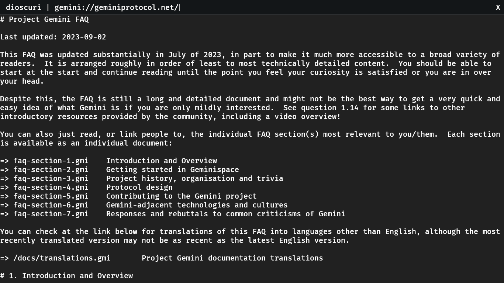

# dioscuri

A mingy TUI browser for the Gemini protocol.

> [!NOTE]
> This is a work in progress.

## Roadmap

The current focus for this project is being able to browse through the hypertext files.

- [ ] Add a functional address bar
- [ ] Add interaction with links (gemini or otherwise)

## Inspired by

- https://geminiprotocol.net/
- https://www.youtube.com/watch?v=5YSj7mAAQQ0
- https://git.sr.ht/~solderpunk/gemini-demo-go/tree/master/item/gemini-demo.go
- https://www.gpui.rs/
- https://github.com/tsoding/voronoi-browser

## License

This project is dual-licensed under either:

- MIT license ([LICENSE-MIT](LICENSE-MIT) or https://opensource.org/licenses/MIT)
- Apache License, Version 2.0, ([LICENSE-APACHE](LICENSE-APACHE) or https://www.apache.org/licenses/LICENSE-2.0)

at your option.
